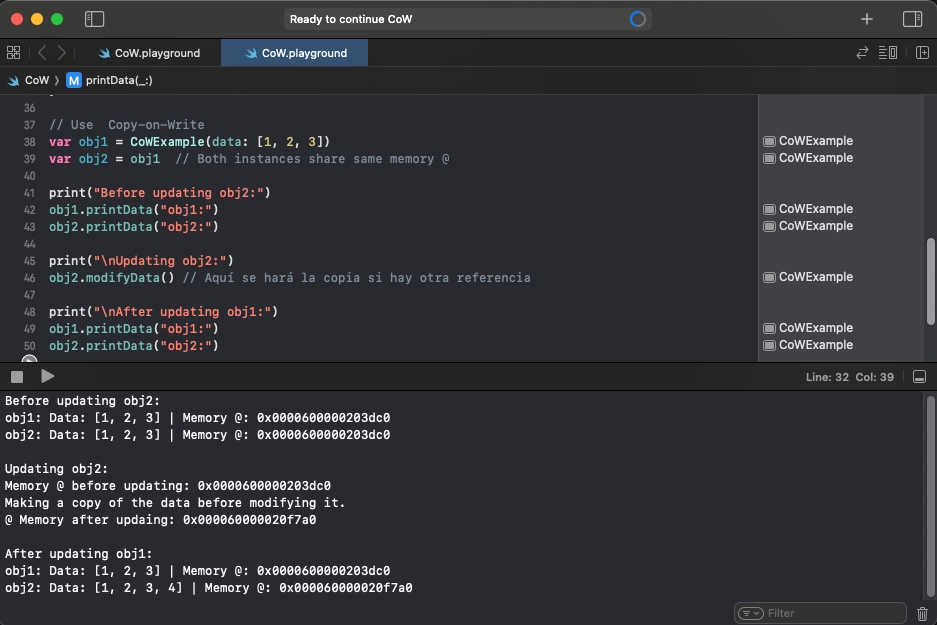

# CoW-Playground
This repository contains a playground that show how Copy-on-Write works on Swift. This is the basecode for following post [Copy-on-Write in Swift: Managing Value Types](https://javios.eu/swift/copy-on-write-in-swift-managing-value-types/)

## Screenshots

## Requirements

- **Xcode 15.0 or later**
- **iOS 16.0 or later**
